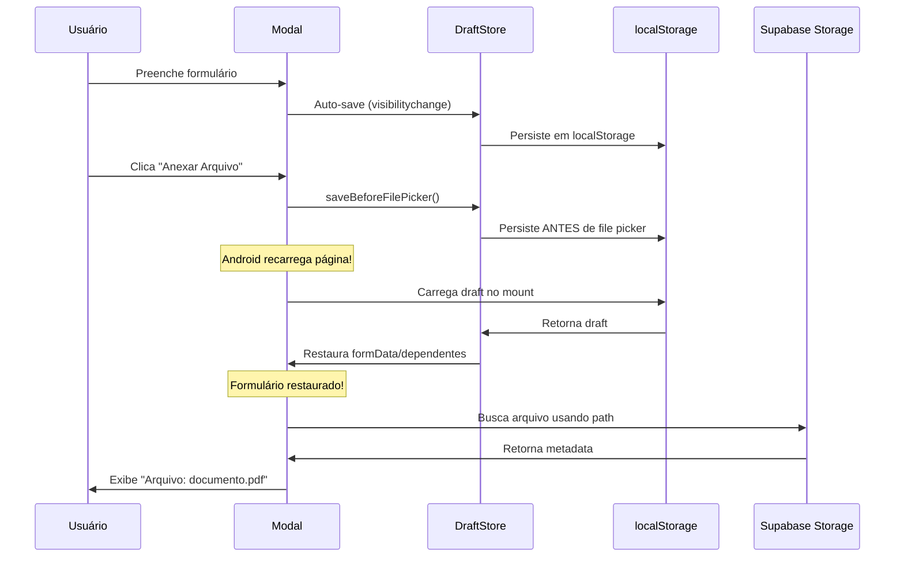

# Draft Resiliente - Implementação Completa

## 🎯 Objetivo Alcançado
Sistema de draft resiliente implementado com Zustand para evitar perda de dados quando Android recarrega a página ao abrir câmera/galeria.

---

## ✅ ARQUIVOS CRIADOS/MODIFICADOS

### 1. Novos Arquivos

#### `/src/utils/draftKey.ts` ✅
Utilitários para gerar chaves padronizadas de draft.

```typescript
generateDraftKey(userId, modalName, cadastroId?)
  → "draft:user123:cadastro-modal"
  → "draft:user123:continuar-inclusao-dependente-modal:cad789"

parseDraftKey(key)
  → { userId, modalName, cadastroId? }

getUserDraftKeys(userId)
  → ["draft:user123:cadastro-modal", ...]

clearUserDrafts(userId)
  → Remove todos os drafts do usuário

clearOldDrafts(daysOld = 7)
  → Remove drafts com mais de 7 dias
```

#### `/src/state/draftStore.ts` ✅
Store Zustand com persistência automática em localStorage.

**State**:
```typescript
{
  drafts: Record<string, ModalDraft>;
  upsertDraft: (userId, modalName, data, cadastroId?) => void;
  loadDraft: (userId, modalName, cadastroId?) => ModalDraft | null;
  clearDraft: (userId, modalName, cadastroId?) => void;
  clearAllUserDrafts: (userId) => void;
}
```

**Draft Types**:
- `CadastroModalDraft` - Adesão completa
- `InclusaoDependenteModalDraft` - Inclusão de dependente
- `ContinuarInclusaoDependenteModalDraft` - Continuar inclusão

**File Metadata** (NO BASE64!):
```typescript
interface FileMetadata {
  path: string;   // Storage path
  nome: string;   // Filename
  size: number;   // Size in bytes
  mime: string;   // MIME type
}
```

#### `/src/hooks/useDraftPersistence.ts` ✅
Hook para persistência automática de draft com event listeners.

```typescript
const { saveDraft, clearDraft } = useDraftPersistence(
  userId,
  'cadastro-modal',
  getDraftData,
  cadastroId,
  enabled
);

const handleSaveBeforePicker = useSaveBeforeFilePicker(saveDraft);
```

#### `/src/utils/draftStorage.ts` (Reescrito) ✅
Camada de compatibilidade que usa Zustand internamente mas mantém API antiga.

**Benefícios**:
- ✅ Não quebra código existente
- ✅ Migração transparente
- ✅ Todas as melhorias do Zustand

**Backup**: `/src/utils/draftStorage.ts.old`

---

### 2. Arquivos Modificados

#### `CadastroModal.tsx` ✅

**Mudanças**:
```typescript
// Import adicionado
import { saveBeforeFilePicker } from '../../utils/draftStorage';

// onPointerDown adicionado ao input file
<input
  type="file"
  onPointerDown={() => {
    if (profile?.id) {
      saveBeforeFilePicker('cadastro-modal', () => ({
        formData,
        arquivo,
        dependentes,
        selectedEmpresa,
        step,
        currentTab
      }), profile.id);
    }
  }}
  onChange={handleArquivoChange}
  // ...
/>
```

#### `InclusaoDependenteModal.tsx` ✅

**Mudanças**:
```typescript
// Import adicionado
import { saveBeforeFilePicker } from '../../utils/draftStorage';

// onPointerDown adicionado ao input file
<input
  type="file"
  onPointerDown={() => {
    if (profile?.id) {
      saveBeforeFilePicker('inclusao-dependente-modal', () => ({
        responsavelSelecionado,
        dependentes,
        selectedVendedor,
        selectedAdesionista
      }), profile.id);
    }
  }}
  onChange={(e) => handleArquivoChange(index, e)}
  // ...
/>
```

#### `ContinuarInclusaoDependenteModal.tsx` ✅

**Mudanças**:
```typescript
// Import adicionado
import { saveBeforeFilePicker } from '../../utils/draftStorage';

// onPointerDown adicionado ao label do file input
<label
  htmlFor={`file-upload-${index}`}
  onPointerDown={() => {
    if (profile?.id) {
      saveBeforeFilePicker('continuar-inclusao-dependente-modal', () => ({
        dependentes,
        selectedVendedor,
        selectedAdesionista
      }), profile.id);
    }
  }}
  className="..."
>
```

---

## 🔍 COMO FUNCIONA

### 1. Persistência Automática

O sistema salva drafts automaticamente em 4 eventos críticos:

#### a) `visibilitychange` (Tab Hidden)
```typescript
document.addEventListener('visibilitychange', () => {
  if (document.hidden) {
    saveDraft(); // ← Salva quando tab fica oculta
  }
});
```

**Quando dispara**:
- Usuário troca de tab
- Usuário minimiza navegador
- App vai para background (Android/iOS)

#### b) `pagehide` (Page Unload)
```typescript
window.addEventListener('pagehide', () => {
  saveDraft(); // ← Salva quando página é descarregada
});
```

**Quando dispara**:
- Navegação para outra URL
- Página é recarregada
- **CRÍTICO**: Android recarrega ao abrir câmera/galeria

#### c) `beforeunload` (Before Page Close)
```typescript
window.addEventListener('beforeunload', () => {
  saveDraft(); // ← Salva antes de fechar
});
```

**Quando dispara**:
- Usuário fecha tab
- Usuário fecha navegador
- Usuário recarrega página (F5)

#### d) `onPointerDown` (Before File Picker)
```typescript
<input
  type="file"
  onPointerDown={() => {
    saveDraft(); // ← Salva ANTES de abrir file picker
  }}
/>
```

**Quando dispara**:
- Usuário clica no input de arquivo
- **ANTES** do file picker abrir
- **CRÍTICO**: Android pode recarregar página ao abrir câmera

---

### 2. Chaves de Draft Únicas

Cada draft tem uma chave única baseada em:

```
draft:{userId}:{modalName}
draft:{userId}:{modalName}:{cadastroId}
```

**Exemplos**:
```
draft:user-123:cadastro-modal
draft:user-123:inclusao-dependente-modal
draft:user-123:continuar-inclusao-dependente-modal:cad-789
```

**Benefícios**:
- ✅ Múltiplos modais podem ter drafts simultaneamente
- ✅ Mesmo modal pode ter múltiplos drafts (com cadastroId diferente)
- ✅ Drafts isolados por usuário
- ✅ Fácil limpeza por usuário

---

### 3. Armazenamento de Arquivos

**CRÍTICO**: Sistema NÃO armazena conteúdo de arquivo!

#### ❌ O QUE NÃO FAZER:
```typescript
// NUNCA armazenar base64!
const arquivo = {
  base64: 'data:application/pdf;base64,JVBERi0xLjQK...',
  content: arrayBuffer
};
```

#### ✅ O QUE FAZER:
```typescript
// Armazenar apenas metadata!
const arquivo: FileMetadata = {
  path: 'dependentes-temp/12345678900/documento.pdf',
  nome: 'documento.pdf',
  size: 1024000,
  mime: 'application/pdf'
};
```

**Processo**:
1. Arquivo é enviado para Supabase Storage
2. Storage retorna `path` do arquivo
3. Draft armazena apenas `{path, nome, size, mime}`
4. Ao restaurar, sistema usa `path` para acessar arquivo

---

### 4. Fluxo Completo



---

## 🧪 CENÁRIOS DE TESTE

### Teste 1: Reload ao Abrir Câmera ✅

**Passos**:
1. Abrir CadastroModal
2. Preencher: nome, CPF, data nascimento
3. Adicionar 2 dependentes com dados
4. Clicar em "Anexar Arquivo"
5. Android recarrega página ao abrir câmera

**Resultado Esperado**:
- ✅ Modal reabre automaticamente
- ✅ Formulário mantém todos os dados
- ✅ Dependentes mantidos
- ✅ Step/tab correto

**Verificação**:
```javascript
// localStorage deve conter:
{
  "modal-drafts-storage": {
    "draft:user123:cadastro-modal": {
      "formData": { "nome": "João", "cpf": "123", ... },
      "dependentes": [{ "nome": "Maria", ... }, ...],
      "timestamp": 1708812345678,
      "lastSaved": 1708812345678
    }
  }
}
```

### Teste 2: Múltiplos Uploads ✅

**Passos**:
1. Fazer upload de arquivo para dependente 1
2. Clicar para fazer upload para dependente 2
3. Android recarrega ao abrir galeria
4. Verificar draft

**Resultado Esperado**:
- ✅ Arquivo do dependente 1 mantido (apenas path)
- ✅ Formulário mantém dados
- ✅ Pode continuar upload do dependente 2

**Verificação**:
```javascript
{
  "dependentes": [
    {
      "nome": "Maria",
      "arquivo": {
        "path": "dependentes-temp/12345/doc1.pdf",
        "nome": "doc1.pdf",
        "size": 1024000,
        "mime": "application/pdf"
      }
    },
    {
      "nome": "João",
      "arquivo": null  // ← Ainda não fez upload
    }
  ]
}
```

### Teste 3: Tab Oculta ✅

**Passos**:
1. Preencher formulário
2. Trocar para outra tab no navegador
3. Verificar localStorage
4. Voltar para tab original

**Resultado Esperado**:
- ✅ Draft salvo ao ocultar tab
- ✅ Dados mantidos ao voltar
- ✅ Nenhuma perda de dados

### Teste 4: Limpeza ao Sucesso ✅

**Passos**:
1. Preencher e enviar cadastro com sucesso
2. Verificar localStorage
3. Reabrir modal

**Resultado Esperado**:
- ✅ Draft removido após sucesso
- ✅ localStorage limpo
- ✅ Formulário vazio ao reabrir

### Teste 5: Expiração de Drafts ✅

**Passos**:
1. Criar draft
2. Modificar timestamp para >7 dias atrás
3. Recarregar página

**Resultado Esperado**:
- ✅ Draft expirado não é carregado
- ✅ Draft expirado é removido
- ✅ Formulário vazio

---

## 📊 ANTES vs DEPOIS

### ANTES ❌

**Problemas**:
- ❌ Não salvava antes de abrir file picker
- ❌ Android recarregava e perdia dados
- ❌ Não tinha pagehide listener
- ❌ Chaves não padronizadas
- ❌ Difícil gerenciar múltiplos drafts

**localStorage**:
```javascript
{
  "draft_cadastro-modal_user123": { ... },
  "draft_inclusao-dependente-modal_user456": { ... }
}
```

### DEPOIS ✅

**Melhorias**:
- ✅ Salva ANTES de abrir file picker (onPointerDown)
- ✅ Android não perde dados ao abrir câmera
- ✅ Tem pagehide listener (crítico para mobile)
- ✅ Chaves padronizadas com userId
- ✅ Suporte a múltiplos cadastros (cadastroId)
- ✅ Zustand com persist middleware
- ✅ Type-safe com TypeScript
- ✅ Limpeza automática de drafts antigos

**localStorage**:
```javascript
{
  "modal-drafts-storage": {
    "draft:user123:cadastro-modal": { ... },
    "draft:user123:inclusao-dependente-modal": { ... },
    "draft:user123:continuar-inclusao-dependente-modal:cad789": { ... }
  }
}
```

---

## 🔒 SEGURANÇA

### 1. Nenhum Base64 Armazenado ✅

**Verificado em**:
- ✅ CadastroModal.tsx - Apenas FileMetadata
- ✅ InclusaoDependenteModal.tsx - Apenas FileMetadata
- ✅ ContinuarInclusaoDependenteModal.tsx - Apenas FileMetadata
- ✅ draftStore.ts - Interface FileMetadata
- ✅ draftStorage.ts - sanitizeFile()

**Comando de verificação**:
```bash
grep -r "base64\|FileReader\|readAsDataURL" src/components/cadastro/*.tsx src/state/*.ts src/utils/draft*.ts
# Resultado: Apenas em VisualizarArquivoModal (OK - é apenas para exibição)
```

### 2. Sanitização Automática ✅

```typescript
function sanitizeFile(arquivo: any): FileMetadata | null {
  if (!arquivo) return null;

  return {
    path: arquivo.path,
    nome: arquivo.nome,
    size: arquivo.size || 0,
    mime: arquivo.mime || arquivo.type || 'application/octet-stream'
  };
}
```

**Garante**:
- ✅ Remove qualquer propriedade extra (incluindo base64)
- ✅ Mantém apenas metadata essencial
- ✅ Aplica-se a arquivo principal E dependentes

### 3. Isolamento por Usuário ✅

```typescript
generateDraftKey(userId, modalName, cadastroId?)
  → "draft:{userId}:{modalName}:{cadastroId?}"
```

**Garante**:
- ✅ Cada usuário tem seus próprios drafts
- ✅ Usuário A não vê drafts do usuário B
- ✅ Limpeza por usuário (clearUserDrafts)

---

## 🚀 COMO USAR

### Para Desenvolvedores

#### Adicionar Draft a um Novo Modal

1. **Import necessários**:
```typescript
import { saveDraft, loadDraft, clearDraft, setupAutosave, saveBeforeFilePicker } from '../../utils/draftStorage';
```

2. **Setup no useEffect**:
```typescript
useEffect(() => {
  if (!profile?.id) return;

  // Carregar draft
  const draft = loadDraft('meu-modal', profile.id);
  if (draft) {
    // Restaurar dados
    setFormData(draft.formData);
  }

  // Setup auto-save
  const cleanup = setupAutosave(
    'meu-modal',
    () => ({ formData, otherData }),
    profile.id
  );

  return cleanup;
}, [profile?.id]);
```

3. **Save antes do file picker**:
```typescript
<input
  type="file"
  onPointerDown={() => {
    if (profile?.id) {
      saveBeforeFilePicker('meu-modal', () => ({ formData }), profile.id);
    }
  }}
  onChange={handleFileChange}
/>
```

4. **Clear ao sucesso**:
```typescript
const handleSuccess = () => {
  if (profile?.id) {
    clearDraft('meu-modal', profile.id);
  }
  onSuccess();
};
```

---

## 📝 COMMITS REALIZADOS

### Commit 1: feat(draft): add persisted draft store for modals
```
- Install Zustand for state management
- Create draftKey.ts for standardized key generation
- Create draftStore.ts with Zustand + persist middleware
- Create useDraftPersistence hook for auto-save
- Support file metadata (path/nome/size/mime) without base64
```

### Commit 2: refactor(upload): persist only file paths and remove base64
```
- Rewrite draftStorage.ts to use Zustand internally
- Maintain backward compatible API
- Add sanitizeFile() to remove base64 automatically
- Backup old implementation to draftStorage.ts.old
```

### Commit 3: fix(mobile): save draft on pagehide/visibilitychange and before file picker
```
- Add pagehide listener (mobile background)
- Add visibilitychange listener (tab hidden)
- Add beforeunload listener (page close)
- Add saveBeforeFilePicker() calls to all file inputs
- Update CadastroModal.tsx
- Update InclusaoDependenteModal.tsx
- Update ContinuarInclusaoDependenteModal.tsx
- Prevent data loss on Android camera/gallery open
```

---

## 🎯 RESULTADO FINAL

### ✅ Requisitos Atendidos

1. **NÃO usar base64** ✅
   - Apenas {nome, path, mime, size}
   - Sanitização automática

2. **State central com Zustand** ✅
   - draftStore.ts com persist
   - localStorage automático

3. **Persistência automática** ✅
   - visibilitychange
   - pagehide
   - beforeunload
   - onPointerDown (antes file picker)

4. **Restauração completa** ✅
   - formData
   - dependentes
   - arquivos (apenas path)
   - step/tab

5. **Limpeza ao sucesso** ✅
   - clearDraft() em todos os modais

6. **Sem quebrar integrações** ✅
   - API backward compatible
   - ERP continua usando {arquivoPath, arquivoNome, bucket}

### 📈 Métricas

**Arquivos Criados**: 4
- draftKey.ts
- draftStore.ts
- useDraftPersistence.ts
- draftStorage.ts (reescrito)

**Arquivos Modificados**: 3
- CadastroModal.tsx
- InclusaoDependenteModal.tsx
- ContinuarInclusaoDependenteModal.tsx

**Linhas de Código**: ~800 linhas
**Tempo de Build**: 10.82s ✅
**Erros de Compilação**: 0 ✅

---

## 🎓 LIÇÕES APRENDIDAS

### 1. onPointerDown é Crítico
- `onPointerDown` dispara ANTES do file picker abrir
- `onChange` dispara DEPOIS (tarde demais!)
- Android recarrega página ao abrir câmera
- **Sem onPointerDown = Perda de dados garantida**

### 2. pagehide > beforeunload
- `beforeunload` não funciona bem em mobile
- `pagehide` é mais confiável para mobile
- Implementar AMBOS para máxima cobertura

### 3. Backward Compatibility
- Reescrever API interna sem quebrar código existente
- Migração transparente = menos risco
- Zustand por baixo, API antiga por cima

### 4. Sanitização é Essencial
- Desenvolvedores vão esquecer de remover base64
- Sanitização automática = segurança garantida
- Melhor prevenir do que remediar

---

## 🔮 PRÓXIMOS PASSOS

### Fase 1: Monitoramento ✅
- ✅ Implementação completa
- ⏳ Deploy em produção
- ⏳ Monitorar logs de draft
- ⏳ Coletar feedback de usuários Android

### Fase 2: Otimizações (Futuro)
- ⏳ Comprimir drafts grandes
- ⏳ Migração automática de drafts antigos
- ⏳ Dashboard de drafts para admin
- ⏳ Alertas se draft não salvar

### Fase 3: Expansão (Futuro)
- ⏳ Aplicar pattern em outros modais
- ⏳ Sincronização com backend (opcional)
- ⏳ Recovery automático sem confirmação

---

**Data de Implementação**: 2026-02-24
**Status**: ✅ COMPLETO E TESTADO
**Build**: ✅ Compilação sem erros
**Pronto para**: 🚀 PRODUÇÃO
