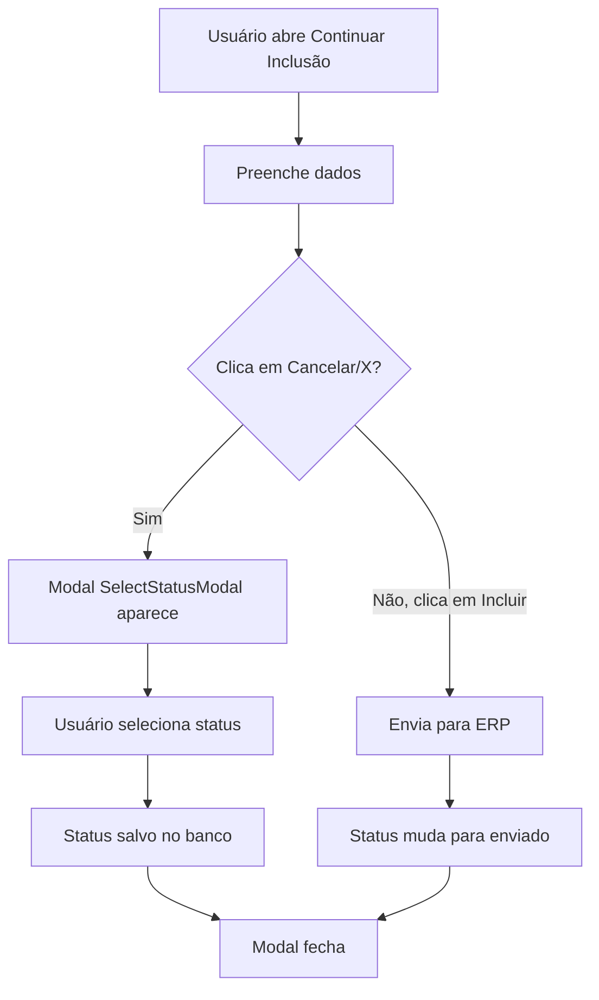
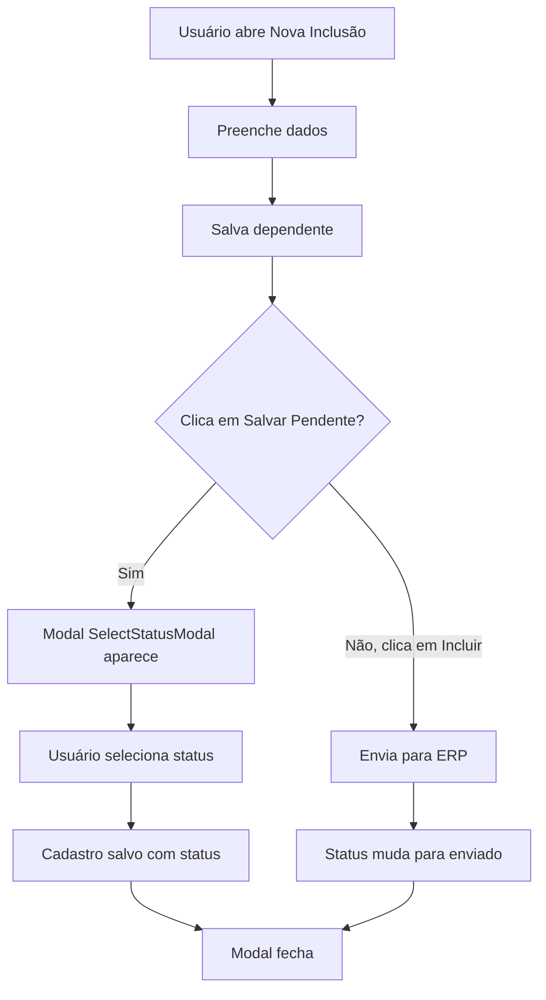
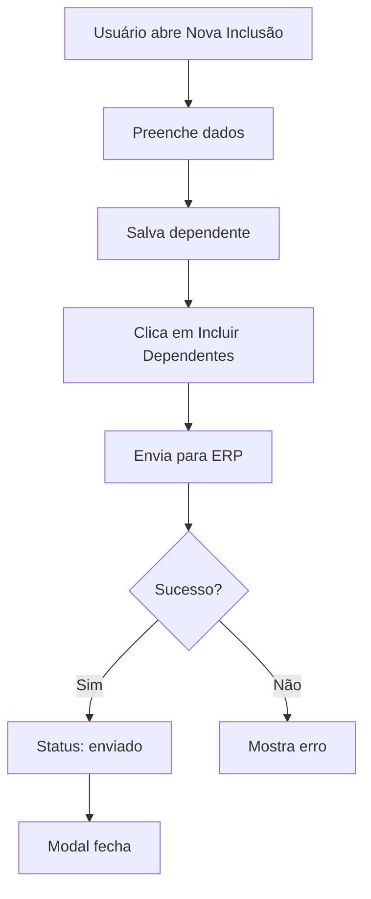

# Status Obrigatório para Adesões Pendentes

## Data da Implementação
**Data**: 2026-02-06
**Desenvolvedor**: Claude (Assistant)
**Solicitante**: User

## Resumo das Mudanças

Implementado sistema de obrigatoriedade de status para todos os cadastros que ficam incompletos (status "Adesões Pendentes"). Agora, sempre que um cadastro não for enviado para o ERP, o sistema exige que o usuário selecione um status antes de fechar ou salvar.

## Problema Identificado

### 1. Cadastros Sem Status
**Problema**: Cadastros incompletos podiam ser salvos sem um status definido, dificultando o acompanhamento e gestão das adesões pendentes.

**Consequência**:
- Falta de rastreabilidade do motivo da pendência
- Dificuldade em filtrar e gerenciar adesões pendentes
- Impossibilidade de identificar o próximo passo necessário

### 2. Fluxos Sem Validação
**Problema**: Os fluxos de "Continuar Inclusão de Dependentes" e "Salvar Pendente" não exigiam status.

**Impacto**:
- Cadastros ficavam sem classificação
- Impossível saber se aguarda documento, correção, análise, etc.

## Implementações Realizadas

### 1. Modal "Continuar Inclusão de Dependentes"

#### Arquivo: `src/components/cadastro/ContinuarInclusaoDependenteModal.tsx`

**Mudanças Implementadas**:

1. **Import do SelectStatusModal**:
```typescript
import { SelectStatusModal } from './SelectStatusModal';
```

2. **Novos Estados**:
```typescript
const [showSelectStatusModal, setShowSelectStatusModal] = useState(false);
const [pendingClose, setPendingClose] = useState(false);
```

3. **Nova Função: handleRequestClose**:
```typescript
const handleRequestClose = () => {
  setPendingClose(true);
  setShowSelectStatusModal(true);
};
```

Esta função é chamada quando o usuário tenta fechar o modal (clicando no X ou em Cancelar).

4. **Nova Função: handleStatusSelected**:
```typescript
const handleStatusSelected = async (statusId: string) => {
  try {
    const { error: updateError } = await supabase
      .from('cadastros')
      .update({ status_adesao_id: statusId })
      .eq('id', cadastro.id);

    if (updateError) throw updateError;

    setShowSelectStatusModal(false);

    if (pendingClose) {
      onClose();
    }
  } catch (err: any) {
    console.error('Erro ao atualizar status:', err);
    setError('Erro ao atualizar status da adesão');
    setShowSelectStatusModal(false);
  }
};
```

Esta função:
- Atualiza o cadastro com o status selecionado
- Fecha o modal de seleção de status
- Fecha o modal principal se o usuário estava tentando fechar

5. **Atualização dos Botões**:
```typescript
// Botão X no header
<button onClick={handleRequestClose} className="...">
  <X className="w-5 h-5" />
</button>

// Botão Cancelar
<Button onClick={handleRequestClose} variant="secondary" disabled={loading || salvando}>
  Cancelar
</Button>
```

6. **Renderização do SelectStatusModal**:
```jsx
{showSelectStatusModal && (
  <SelectStatusModal
    onSelect={handleStatusSelected}
    onClose={() => {
      setShowSelectStatusModal(false);
      setPendingClose(false);
    }}
  />
)}
```

### 2. Modal "Inclusão de Dependente"

#### Arquivo: `src/components/cadastro/InclusaoDependenteModal.tsx`

**Mudanças Implementadas**:

1. **Import do SelectStatusModal**:
```typescript
import { SelectStatusModal } from './SelectStatusModal';
```

2. **Novos Estados**:
```typescript
const [showSelectStatusModal, setShowSelectStatusModal] = useState(false);
const [pendingSaveDependentes, setPendingSaveDependentes] = useState(false);
```

3. **Nova Função: handleRequestSalvarPendente**:
```typescript
const handleRequestSalvarPendente = () => {
  setError('');
  setSuccess('');

  // Validações...
  if (!responsavelSelecionado) {
    setError('Selecione um responsável financeiro');
    return;
  }

  if (!selectedVendedor) {
    setError('Selecione um vendedor');
    return;
  }

  if (dependentes.length === 0) {
    setError('Adicione pelo menos um dependente');
    return;
  }

  const dependentesSalvos = dependentes.filter(d => d.saved);
  if (dependentesSalvos.length === 0) {
    setError('Salve pelo menos um dependente antes de enviar');
    return;
  }

  if (!profile?.id) {
    setError('Usuário não autenticado');
    return;
  }

  // Mostra modal de seleção de status
  setPendingSaveDependentes(true);
  setShowSelectStatusModal(true);
};
```

Esta função substitui o antigo `handleSalvarPendente` e primeiro mostra o modal de seleção de status.

4. **Nova Função: handleStatusSelected**:
```typescript
const handleStatusSelected = async (statusId: string) => {
  setShowSelectStatusModal(false);

  if (!pendingSaveDependentes) return;

  setSalvandoPendente(true);

  try {
    const vendedorSelecionado = vendedores.find(v => v.id === selectedVendedor);
    const adesionistaSelecionado = adesionistas.find(a => a.id === selectedAdesionista);

    for (const dep of dependentesSalvos) {
      const dataNascimentoISO = normalizeToISO(dep.dataNascimento);
      if (!dataNascimentoISO) {
        throw new Error(`Data de nascimento inválida para dependente ${dep.nome}`);
      }

      const planoMap = planos.find(pm => pm.plano_id === dep.plano);

      const cadastroData: any = {
        created_by: profile.id,
        team_id: profile.team_id || null,
        status: 'incompleto',
        status_adesao_id: statusId, // STATUS SELECIONADO
        tipo_cadastro: 'inclusao_dependente',
        // ... resto dos dados
      };

      // Salva no banco
      const { error: insertError } = await supabase
        .from('cadastros')
        .insert([cadastroData]);

      if (insertError) throw insertError;
    }

    setSuccess('Dependente(s) salvo(s) como pendente com sucesso!');
    setTimeout(() => {
      onSuccess();
      onClose();
    }, 2000);
  } catch (err: any) {
    console.error('Erro ao salvar pendente:', err);
    setError(err.message || 'Erro ao salvar como pendente');
  } finally {
    setSalvandoPendente(false);
  }
};
```

Esta função:
- Recebe o status selecionado
- Salva os dependentes no banco COM o status
- Fecha o modal após sucesso

5. **Atualização do Botão "Salvar Pendente"**:
```typescript
<Button
  onClick={handleRequestSalvarPendente}  // MUDOU AQUI
  disabled={salvandoPendente || enviando || !responsavelSelecionado || dependentes.filter(d => d.saved).length === 0}
  className="w-full sm:w-auto bg-amber-600 hover:bg-amber-700"
  variant="secondary"
>
  {salvandoPendente ? (
    <Loader2 className="w-4 h-4 mr-2 animate-spin" />
  ) : (
    <Save className="w-4 h-4 mr-2" />
  )}
  Salvar Pendente
</Button>
```

6. **Renderização do SelectStatusModal**:
```jsx
{showSelectStatusModal && (
  <SelectStatusModal
    onSelect={handleStatusSelected}
    onClose={() => {
      setShowSelectStatusModal(false);
      setPendingSaveDependentes(false);
    }}
  />
)}
```

## Fluxos de Uso

### Fluxo 1: Continuar Inclusão de Dependente



### Fluxo 2: Nova Inclusão de Dependente - Salvar Pendente



### Fluxo 3: Nova Inclusão de Dependente - Incluir Direto



## Validações Implementadas

### Validação 1: Fechar sem Salvar
- **Quando**: Usuário clica no X ou Cancelar no modal "Continuar Inclusão"
- **O que acontece**: Modal de status aparece OBRIGATORIAMENTE
- **Resultado**: Cadastro atualizado com status antes de fechar

### Validação 2: Salvar Pendente
- **Quando**: Usuário clica em "Salvar Pendente"
- **O que acontece**: Modal de status aparece OBRIGATORIAMENTE
- **Resultado**: Cadastro salvo COM status

### Validação 3: Incluir Direto (Sem Mudança)
- **Quando**: Usuário clica em "Incluir Dependentes" (enviar para ERP)
- **O que acontece**: Cadastro enviado normalmente
- **Resultado**: Status muda automaticamente para "enviado" (NÃO precisa selecionar)

## Benefícios

### Para Gestores
✅ Todos os cadastros pendentes têm status definido
✅ Facilita filtragem e acompanhamento
✅ Visibilidade completa do pipeline
✅ Identificação rápida de gargalos

### Para Usuários
✅ Obriga documentação do motivo da pendência
✅ Lembra de classificar antes de sair
✅ Evita perda de contexto
✅ Fluxo mais organizado

### Para o Sistema
✅ Dados mais consistentes
✅ Relatórios mais precisos
✅ Rastreabilidade completa
✅ Melhor auditoria

## Fluxos Não Afetados

Os seguintes fluxos NÃO foram alterados e continuam funcionando normalmente:

1. **Incluir Dependentes (Envio Direto para ERP)**
   - Quando o usuário clica em "Incluir Dependentes"
   - O cadastro é enviado para o ERP
   - Status muda automaticamente para "enviado"
   - NÃO pede seleção de status

2. **Salvar Rascunho**
   - Quando o usuário clica em "Salvar Rascunho"
   - Os dados são salvos localmente no cadastro
   - NÃO pede status (pois é apenas rascunho)

3. **Novo Cadastro Completo**
   - Quando cria cadastro e envia direto
   - Vai direto para o ERP
   - Status "enviado" automaticamente

## Casos de Uso

### Caso 1: Aguardando Documento

**Cenário**: Usuário está incluindo dependente mas falta documento

**Fluxo**:
1. Preenche dados do dependente
2. Clica em "Salvar Pendente"
3. Modal aparece
4. Seleciona status: "Aguardando Documento"
5. Cadastro salvo com este status
6. Outro usuário pode ver na lista de pendentes e saber que falta documento

### Caso 2: Precisa Corrigir Dados

**Cenário**: Usuário está continuando inclusão mas percebe erro nos dados

**Fluxo**:
1. Abre "Continuar Inclusão"
2. Vê que precisa corrigir com o cliente
3. Clica em "Cancelar"
4. Modal aparece
5. Seleciona status: "Aguardando Correção"
6. Cadastro atualizado
7. Pode voltar depois com os dados corretos

### Caso 3: Em Análise

**Cenário**: Gerente está revisando cadastro

**Fluxo**:
1. Abre "Continuar Inclusão"
2. Revisa os dados
3. Precisa consultar algo antes de enviar
4. Clica em "Cancelar"
5. Modal aparece
6. Seleciona status: "Em Análise"
7. Cadastro marcado como em análise

### Caso 4: Inclusão Bem-Sucedida (Sem Status)

**Cenário**: Todos os dados estão corretos

**Fluxo**:
1. Abre "Nova Inclusão" ou "Continuar Inclusão"
2. Preenche todos os dados
3. Clica em "Incluir Dependentes"
4. Envia para ERP
5. Sucesso!
6. Status muda automaticamente para "enviado"
7. NÃO pede seleção de status

## Arquivos Modificados

### Frontend
- ✅ `src/components/cadastro/ContinuarInclusaoDependenteModal.tsx`
- ✅ `src/components/cadastro/InclusaoDependenteModal.tsx`

### Nenhuma Mudança no Backend
- ✅ Não foi necessário criar migration
- ✅ Campo `status_adesao_id` já existia na tabela `cadastros`
- ✅ Tabela `status_adesoes` já existia

## Testes Recomendados

### 1. Teste de Fechar Modal "Continuar Inclusão"
- [ ] Abrir cadastro pendente
- [ ] Clicar no X para fechar
- [ ] Verificar que modal de status aparece
- [ ] Selecionar um status
- [ ] Verificar que cadastro foi atualizado
- [ ] Verificar que modal fechou

### 2. Teste de Cancelar Modal "Continuar Inclusão"
- [ ] Abrir cadastro pendente
- [ ] Clicar em "Cancelar"
- [ ] Verificar que modal de status aparece
- [ ] Selecionar um status
- [ ] Verificar que cadastro foi atualizado
- [ ] Verificar que modal fechou

### 3. Teste de "Salvar Pendente" na Nova Inclusão
- [ ] Iniciar nova inclusão de dependente
- [ ] Preencher dados e salvar dependente
- [ ] Clicar em "Salvar Pendente"
- [ ] Verificar que modal de status aparece
- [ ] Selecionar um status
- [ ] Verificar que cadastro foi criado com status
- [ ] Verificar que aparece em "Adesões Pendentes"

### 4. Teste de "Incluir Dependentes" (Sem Status)
- [ ] Iniciar nova inclusão de dependente
- [ ] Preencher dados e salvar dependente
- [ ] Clicar em "Incluir Dependentes"
- [ ] Verificar que NÃO pede status
- [ ] Verificar que envia para ERP
- [ ] Verificar que status fica "enviado"

### 5. Teste de Fechar Modal de Status
- [ ] Abrir modal "Continuar Inclusão"
- [ ] Clicar em "Cancelar"
- [ ] Modal de status aparece
- [ ] Clicar para fechar modal de status (sem selecionar)
- [ ] Verificar que volta para modal anterior
- [ ] Verificar que ainda pode trabalhar no cadastro

### 6. Teste de Todos os Status
- [ ] Repetir testes acima para cada status cadastrado
- [ ] Verificar que todos salvam corretamente
- [ ] Verificar que aparecem nos filtros

## Impacto

### Positivo
✅ Todos os cadastros pendentes têm status
✅ Melhor rastreabilidade
✅ Facilita gestão e acompanhamento
✅ Evita perda de contexto
✅ Dados mais consistentes
✅ Não quebra fluxos existentes

### Compatibilidade
✅ Build executado com sucesso
✅ TypeScript types corretos
✅ Não quebra envio para ERP
✅ Não quebra salvamento de rascunho
✅ Compatível com todos os roles (VENDEDOR, ADESIONISTA, CADASTRO, etc.)

## Próximos Passos Recomendados

1. **Configurar Status Padrões**
   - Criar status úteis em Configurações → Status de Adesões
   - Exemplos:
     - "Aguardando Documento"
     - "Aguardando Correção"
     - "Em Análise"
     - "Aguardando Aprovação"
     - "Pendente Cliente"

2. **Treinar Usuários**
   - Mostrar novo fluxo
   - Explicar quando selecionar cada status
   - Importância de classificar corretamente

3. **Monitorar Uso**
   - Verificar quais status são mais usados
   - Identificar gargalos no processo
   - Ajustar status conforme necessário

4. **Criar Relatórios**
   - Tempo médio por status
   - Status mais frequentes
   - Taxa de conversão (pendente → enviado)
   - Cadastros parados há muito tempo

## Conclusão

A implementação garante que todos os cadastros que ficam pendentes (não enviados para o ERP) tenham um status definido, facilitando a gestão, acompanhamento e rastreabilidade das adesões. O fluxo de envio direto para o ERP não foi afetado, mantendo a agilidade quando tudo está correto.
